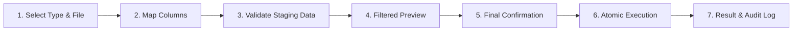

# MediDesk — Icon-First Actions & Safe Bulk Import/Export UX Architecture

**Document Version:** 2.0.0  
**Date:** 2026-08-30  
**Target Environment:** Windows Desktop Electron (Offline-First)  
**Governance Status:** Approved UI/UX & Data Onboarding Capability  

---

## 1. Global Icon-First Action Standard

MediDesk enforces a consistent, accessible, and recognizable icon system across all clinical and administrative views using `lucide-react`.

### Action & Entity Icon Matrix

| Category | UI Element / Action | Lucide Icon | Behavior & Label Invariant |
|---|---|---|---|
| **Primary Actions** | Add / Create | `Plus` | Icon + Text (e.g. `[ + Add Product SKU ]`, `[ + Register Patient ]`) |
| | Import Data | `UploadCloud` | Icon + Text (e.g. `[ ↑ Import Medicines ]`) |
| | Export Data | `Download` | Icon + Text (e.g. `[ ↓ Export Medicines ]`) |
| | Save / Commit | `CheckCircle` / `Save` | Icon + Text (e.g. `[ ✓ Save Changes ]`) |
| | Cancel / Close | `X` | Icon + Text (e.g. `[ ✕ Cancel ]`) |
| | Refresh List | `RefreshCw` | Icon button with accessible tooltip and spinning state |
| **Row / Secondary Actions** | Edit Profile / SKU | `Pencil` | Compact icon button with `title="Edit ..."` |
| | View Details | `Eye` | Compact icon button with `title="View ..."` |
| | Toggle Active Status | `CheckCircle` / `XCircle` | Semantic color badge + text |
| | Book Appointment | `Calendar` | Icon + Text (`Book`) |
| **Domain Entities** | Medicine SKU | `Pill` | Blue accent icon |
| | Molecule / Generic | `FlaskConical` | Indigo accent icon |
| | Manufacturer / Company | `Building2` | Teal accent icon |
| | Patient Directory | `User` | Blue accent icon |
| | Doctor Directory | `Stethoscope` | Emerald accent icon |
| | Pharmacy POS | `ShoppingCart` / `Receipt` | Indigo accent icon |
| | Inventory & Batches | `Boxes` / `Layers` | Amber/Rose accent icon |
| | Suppliers & Inward | `Truck` | Amber accent icon |
| | Barcodes | `Barcode` / `Scan` | Cyan accent icon |

---

## 2. Molecule & Company Autocomplete Selectors

In the Medicine Master form (`MedicineMasterView.tsx`), selection of chemical molecules and pharmaceutical manufacturers is upgraded from static HTML `<select>` elements to reactive autocomplete components:

```
┌────────────────────────────────────────────────────────┐
│ ⚗️ Generic Molecule *          [ + Add Molecule ]      │
│ ┌────────────────────────────────────────────────────┐ │
│ │ 🔍 Type chemical name (e.g. Paracetamol)...        │ │
│ └────────────────────────────────────────────────────┘ │
│  • Paracetamol (Analgesic / Antipyretic) [Sch GENERAL] │
│  • Amoxicillin + Clavulanic Acid [Sch H]               │
└────────────────────────────────────────────────────────┘
```

1. **Reactive Search:** Typeahead search matches generic chemical salts, therapeutic classifications, and schedule categories.
2. **Inline Add Molecule:** Clicking `[ + Add Molecule ]` opens a sub-modal to register the molecule and automatically selects it in the product form upon save without losing other entered fields.
3. **Inline Add Company:** `[ + Add Company ]` validates against accidental duplicate company names (case-insensitive) and auto-selects the newly registered manufacturer.

---

## 3. Multi-Step Guarded Bulk Import Pipeline

Import operations NEVER execute immediately against the authoritative database. They follow a 7-stage staged validation pipeline:



### Stage Details:
1. **Select Type & File:** Dedicated record cards with sample CSV templates pre-populated with Indian pharmacy formats.
2. **Column Mapping Interface:** Auto-detects matching headers, displays status badges (`✓ Mapped`, `⚠ Optional Unmapped`, `✕ Required Missing`), and allows non-technical field remapping.
3. **Staged Validation & Policy Selection:**
   - `[ + ] Add new records`
   - `[ ↻ ] Update existing records`
   - `[ +/↻ ] Add new + update (Upsert)`
   - `[ ! ] Skip duplicate records`
   - `[ ⚠ ] Reject entire file on error` (Mandatory for high-risk opening stock)
4. **Filtered Preview Table:** Displays breakdown counters (`✓ Ready to Add`, `↻ Ready to Update`, `⚠ Need Review`, `✕ Invalid`, `⏭ Duplicates to Skip`) with search filtering and direct `[ ↓ Download Error Report ]` CSV generator.
5. **Final Confirmation Modal:** Explicit warning breakdown of rows to be added, updated, or skipped. High-risk opening stock requires explicit Owner verification checkbox.
6. **Atomic Transaction Execution:** Executes within serialized SQLite transaction (`BEGIN IMMEDIATE`) with complete rollback on failure.
7. **Result & Audit Log:** Summary metrics, execution timing, and structured `DATA_IMPORTED` / `DATA_IMPORT_FAILED` audit trail recording.

---

## 4. Controlled Bulk Data Export System

Export functionality (`DataExportModal.tsx`) is available on:
- **Medicine Master & Product Catalog**
- **Patient Directory**
- **Doctor Directory**
- **Inventory & Stock Ledger**
- **Suppliers & Purchase Inward**

### Export Features:
1. **Format Selection:** Excel-compatible UTF-8 BOM CSV or structured JSON.
2. **Scope Filtering:** `All Records` vs. `Active Only` vs. `Current Filtered Results`.
3. **Column Customization:** Checkbox toggles to include/exclude specific columns.
4. **Live Data Preview:** Shows sample data before generating download.
5. **Read-Only Invariant:** Zero database mutations occur during export.

---

## 5. Security, RBAC & Safety Invariants

1. **Zero Raw SQL / Zero Shell IPC:** All imports and exports use validated, typed IPC channels (`import:validate-file`, `import:execute`).
2. **Integer-Paise Precision:** All financial values are strictly converted to integer Paise (`Math.round(rupees * 100)`).
3. **CSV Formula Injection Defense:** Strips dangerous prefix characters (`=`, `+`, `-`, `@`).
4. **Developer Isolation:** Developer role is strictly denied from importing or exporting clinical, patient, or pharmacy data.
5. **Tamper-Evident Audit Trail:** Every bulk operation logs an immutable record with actor credentials, record type, duration, and metrics.
