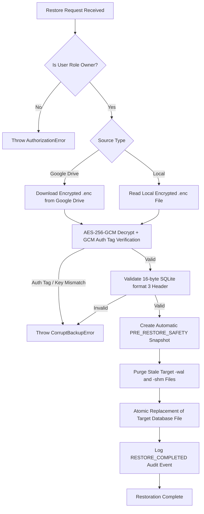

# Technical Architecture: Backup & Disaster Recovery Engine

## 1. Overview
The `@medidesk/backup` subsystem provides offline-first, point-in-time database snapshotting, authenticated AES-256-GCM encryption, off-site Google Drive synchronization, and disaster recovery for MediDesk workstations.

## 2. Hybrid Backup Architecture
MediDesk supports three operating modes:
- **`HYBRID` (Default & Recommended):** Immediate local encrypted snapshot + background opportunistic Google Drive upload.
- **`LOCAL_ONLY`:** Pure offline encrypted local snapshotting with zero network dependencies.
- **`CLOUD_ONLY`:** Uploads encrypted artifact to Google Drive and purges local copy upon verification.

### Critical Invariant:
**Google Drive failure or lack of Internet connectivity MUST NEVER cause local backup failure.**  
If network connectivity is unavailable, the local backup completes with `localStatus = 'SUCCESS'` and cloud upload is marked `cloudStatus = 'PENDING'`, leaving the overall state as `PARTIAL`.

---

## 3. Cryptographic Specification & Storage Format
All backup copies (local and cloud) use the exact same encrypted binary artifact (`.enc`).
1. **Magic Header:** 15-byte `MEDIDESK_ENC_V1`
2. **Salt:** 16-byte cryptographically secure random salt
3. **Key Derivation:** **scrypt** (256-bit symmetric key)
4. **Nonce / IV:** 12-byte random IV
5. **Cipher:** **AES-256-GCM** with 16-byte authentication tag
6. **Sidecar:** Companion `.sha256` checksum file

```
+-----------------------------------------------------------------------------------+
| MAGIC (15B) | SALT (16B) | IV (12B) | AUTH_TAG (16B) | CIPHERTEXT (Variable len) |
+-----------------------------------------------------------------------------------+
```

---

## 4. Restore Workflow with Zero Data Loss Guarantee
Restore requires **Owner role authorization** (`system.restore.execute`). Developers, Doctors, and Staff are strictly denied.



---

## 5. Retention & Cloud Retry Policies
- **Retention Invariant:** The retention pruning algorithm never deletes the last remaining recovery copy. At least 1 verified recovery backup is preserved at all times.
- **Cloud Retry Queue:** `retryPendingCloudBackups()` iterates over pending cloud uploads and reuses the existing verified local `.enc` artifact without regenerating database snapshots.

---

## 6. Audit & RBAC Controls
- `system.backup.create`: Granted to Owner, Doctor, Staff.
- `system.backup.read`: Granted to Owner, Staff.
- `system.restore.execute`: Granted **exclusively** to Owner (`role-owner`). Strictly forbidden for Developer (`role-developer`), Doctor, and Staff.
