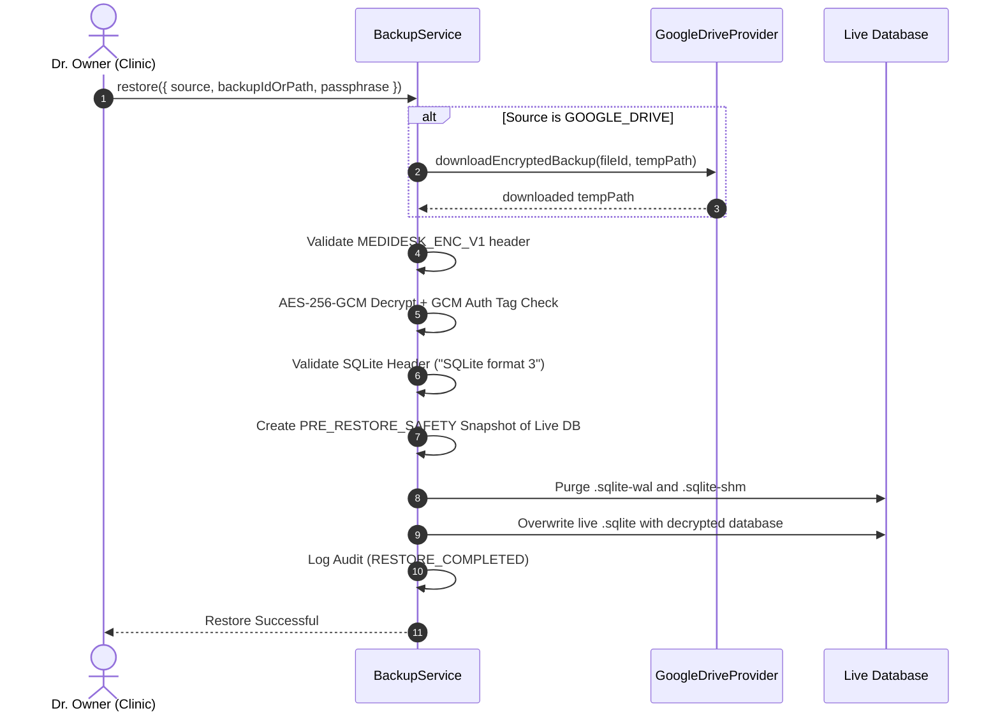

# MediDesk Hybrid Backup & Disaster Recovery Architecture

## 1. Overview & Business Objectives

MediDesk is an offline-first clinical and retail pharmacy management system. In healthcare environments, database loss from hardware failure, malware, theft, or fire can lead to catastrophic disruptions.

The **Hybrid Backup Engine** combines local offline atomic point-in-time snapshots with off-site cloud storage on Google Drive.

```mermaid
flowchart TD
    A[Trigger Backup (Manual / Daily Schedule)] --> B[WAL Checkpoint TRUNCATE]
    B --> C[Read Consistent SQLite Snapshot]
    C --> D[AES-256-GCM + scrypt Encryption]
    D --> E[Generate SHA-256 Checksum & .sha256 Sidecar]
    E --> F[Save Local Encrypted Artifact .enc]
    F --> G{Backup Mode}
    G -->|LOCAL_ONLY| H[Mark Local SUCCESS / Cloud NONE]
    G -->|HYBRID / CLOUD_ONLY| I{Check Internet & Google Drive}
    I -->|Offline / Disconnected| J[Mark Local SUCCESS / Cloud PENDING -> Overall: PARTIAL]
    I -->|Online & Connected| K[Upload Encrypted Artifact to Google Drive]
    K --> L{Upload Successful?}
    L -->|Yes| M[Verify Remote File & Mark Cloud SUCCESS -> Overall: CLOUD_SUCCESS]
    L -->|No| N[Mark Cloud FAILED -> Overall: PARTIAL -> Queue for Retry]
    M --> O{Mode is CLOUD_ONLY?}
    O -->|Yes| P[Purge Local .enc File]
    O -->|No| Q[Keep Local .enc File]
```

---

## 2. Operating Modes

| Mode | Local Backup | Google Drive Sync | Internet Requirement | Default |
| :--- | :---: | :---: | :---: | :---: |
| **`HYBRID`** | Yes (Encrypted) | Yes (Encrypted) | Opportunistic (Independent) | **YES (Recommended)** |
| **`LOCAL_ONLY`** | Yes (Encrypted) | No | **Zero Internet Required** | No |
| **`CLOUD_ONLY`** | Temp Local $\rightarrow$ Purged | Yes (Encrypted) | Required for upload | No |

### Critical Invariant:
**Google Drive failure MUST NEVER cause local backup failure.**  
If network connectivity is down, the local backup completes successfully (`LOCAL_SUCCESS`), while cloud upload is marked `PENDING` without blocking clinic operations.

---

## 3. Cryptographic Specification & Artifact Format

Both local and remote copies use the exact same encrypted binary artifact (`.enc`). Unencrypted SQLite databases are never transmitted to external cloud services.

1. **Header:** 15-byte magic string `MEDIDESK_ENC_V1`.
2. **Salt:** 16 cryptographically random bytes (`crypto.randomBytes(16)`).
3. **Key Derivation:** **scrypt** (`crypto.scryptSync(passphrase, salt, 32)`) generating a 256-bit symmetric key.
4. **Nonce / IV:** 12 cryptographically random bytes (`crypto.randomBytes(12)`).
5. **Cipher:** **AES-256-GCM** (Galois/Counter Mode).
6. **Authentication Tag:** 16-byte GCM authentication tag for tamper detection.
7. **Integrity Sidecar:** Companion `.sha256` sidecar file storing the hex digest over the complete encrypted payload.

```
+-----------------------------------------------------------------------------------+
| MAGIC (15B) | SALT (16B) | IV (12B) | AUTH_TAG (16B) | CIPHERTEXT (Variable len) |
+-----------------------------------------------------------------------------------+
```

---

## 4. Google Drive Provider Integration

The [`GoogleDriveProvider`](file:///c:/Users/User2/Documents/Project/MediDesk/packages/backup/src/GoogleDriveProvider.ts) implements the Google Drive REST API v3:
- **OAuth 2.0 PKCE:** Secure authorization code exchange and token refresh.
- **Multipart Uploads:** Encrypted binary streams paired with JSON metadata (organization ID, SHA-256 checksum, backup ID).
- **Duplicate Prevention:** Checks existing files by name (`medidesk-encrypted-${timestamp}-${backupId}.enc`) before upload.
- **Quota Monitoring:** Checks available Google Drive storage via `drive.about.get`.
- **Offline Resiliency:** Gracefully catches network aborts, timeouts, and quota errors without crashing or throwing unhandled promises.

---

## 5. Cloud Retry Queue

When a hybrid backup succeeds locally but fails to reach Google Drive (due to network disruption):
1. The backup record is stored with `local_status = 'SUCCESS'`, `cloud_status = 'PENDING'`, and `overall_status = 'PARTIAL'`.
2. When the clinic reconnects or the user clicks **Retry Cloud**, `BackupService.retryPendingCloudBackups()` iterates over pending entries.
3. The verified local `.enc` artifact is uploaded directly without re-reading or recreating the database snapshot.
4. Upon confirmation, the status transitions to `cloud_status = 'SUCCESS'`, `overall_status = 'CLOUD_SUCCESS'`.

---

## 6. Restore Workflow & Pre-Restore Safety Snapshot

Restore requires **Owner role authorization** (Developers are denied):



---

## 7. Retention Policy

- **Local Retention:** Configurable (default: 30 days).
- **Cloud Retention:** Configurable (default: 90 days).
- **Retention Invariant:** **Never delete the only available recovery copy.** Even if all backups are older than the retention threshold, at least 1 verified recovery snapshot is strictly preserved.
