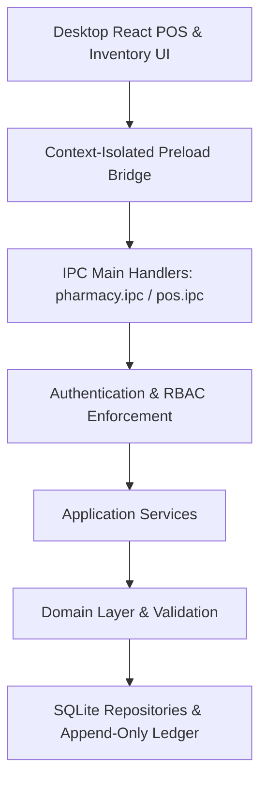

# MediDesk Phase 5: Pharmacy, Inventory & Billing Architecture

## Overview
Phase 5 implements the complete pharmacy management, medicine master, supplier purchasing, batch-aware inventory ledger, and point-of-sale (POS) billing subsystems for MediDesk.

## Architectural Components

### 1. Separation of Generic Molecules and Brand SKUs
- `Medicine`: Canonical chemical entity (e.g. Paracetamol, Schedule H/H1/X flags, therapeutic class).
- `MedicineProduct`: Marketed brand SKU (e.g. "Dolo 650 Tablet", 15 tabs/strip, HSN 30049060, tax 12%, barcode).
- `Manufacturer`: Pharmaceutical company entity (e.g. Micro Labs, Cipla).

### 2. Inward Purchasing & Base Unit Accounting
- Purchases record supplier invoices, pack quantities, free goods, and discount.
- Inventory batches (`inventory_batches`) and ledger records (`stock_movements`) account for inventory strictly in **base units**.

### 3. FEFO Dispensing & POS Billing
- Automated First Expire First Out batch selection.
- Walk-in vs Patient sale separation.
- Indian GST tax breakdown (CGST + SGST), round-off calculation, printable receipts.
- Customer returns with automatic inventory restoration.

### 4. RBAC Isolation
- `DEVELOPER` role receives ZERO access to pharmacy business/stock data.
- `OWNER` has full administrative, adjustment, and cancellation rights.
- `STAFF` has operational POS dispensing and inward receiving rights.
- `DOCTOR` has read-only access to medicine catalog for prescribing.
